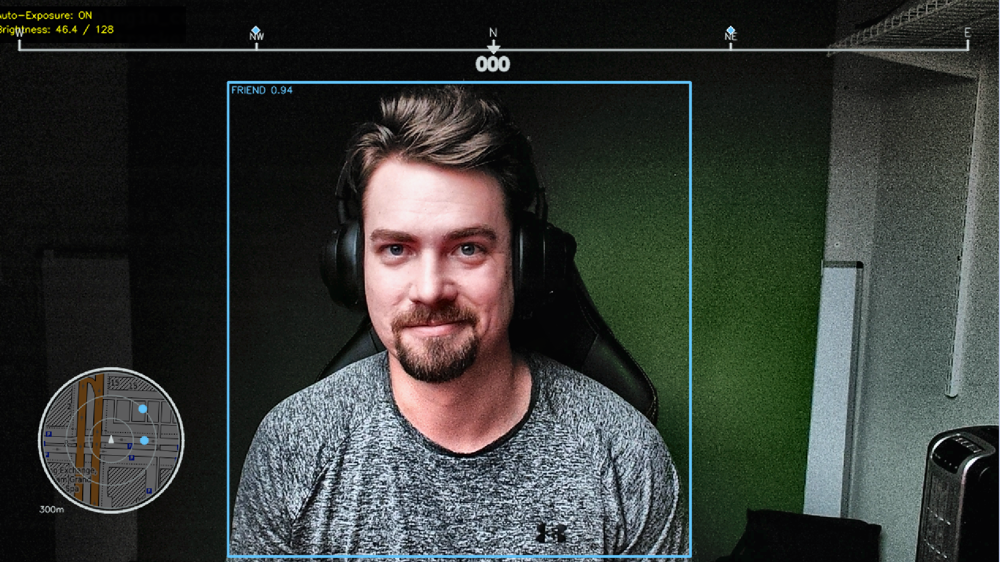

# PROJECT WARLOCK

> **W**earable **A**ugmented **R**eality & **L**inked **O**perational **C**ombat **K**it

**Halo-style tactical HUD for real-world operations. Open source. Built for civilians.**



---

## MISSION

Build a helmet-mounted AR system with:
- Real-time object detection and IFF
- GPS navigation with terrain overlay
- Night vision and thermal imaging
- Team coordination and data sharing
- Field-hardened, modular, extensible

---

## QUICK START

```bash
git clone https://github.com/preparedcitizencorps/warlock.git
cd warlock
pip install -r requirements.txt
python software/warlock.py
```

**Controls:**
- `Q` - Quit | `H` - Help | `P` - Plugin panel
- `Y` - YOLO toggle | `F` - FPS | `B` - Boundaries
- `[`/`]` - Adjust padding | Arrows - Simulate movement

---

## CAPABILITIES

- **Modular plugin architecture** - Hot-swappable components
- **Real-time object detection** - YOLO11n with friend/foe IFF
- **GPS navigation** - Compass + motion tracker with terrain
- **Runtime management** - Live reload, enable/disable plugins
- **AR display ready** - Configurable padding for headset FOV

---

## BUILDING PLUGINS

### 1. Create Plugin File

`software/hud/plugins/target_tracker.py`:
```python
#!/usr/bin/env python3
from hud.plugin_base import HUDPlugin, HUDContext, PluginConfig, PluginMetadata
import cv2
import numpy as np

class TargetTrackerPlugin(HUDPlugin):
    METADATA = PluginMetadata(
        name="Target Tracker",
        version="1.0.0",
        author="Your Callsign",
        description="Tracks and displays priority targets",
        provides=['target_list'],
        consumes=['yolo_detections']  # Soft dependency
    )

    def __init__(self, context: HUDContext, config: PluginConfig):
        super().__init__(context, config)

    def initialize(self) -> bool:
        self.targets = []
        return True

    def process_targets(self, detections: list):
        new_targets = []
        for det in detections:
            if det.get('confidence', 0) > 0.5:
                x1, y1, x2, y2 = det['bbox']
                center_x = (x1 + x2) // 2
                center_y = (y1 + y2) // 2
                new_targets.append({
                    'pos': (center_x, center_y),
                    'id': det.get('id', len(new_targets)),
                    'confidence': det['confidence']
                })
        self.targets = new_targets

    def update(self, delta_time: float):
        detections = self.get_data('yolo_detections', [])
        self.process_targets(detections)
        self.provide_data('target_list', self.targets)

    def render(self, frame: np.ndarray) -> np.ndarray:
        if not self.visible:
            return frame
        # Draw targeting reticles
        for target in self.targets:
            cv2.circle(frame, target['pos'], 20, (0, 255, 0), 2)
        return frame

    def handle_key(self, key: int) -> bool:
        if key == ord('t'):
            self.toggle_visibility()
            return True
        return False
```

### 2. Add to Config

`software/hud_config.yaml`:
```yaml
plugins:
  - name: TargetTrackerPlugin
    enabled: true
    visible: true
    z_index: 50
    settings:
      max_targets: 10
      priority_range: 100  # meters
```

### 3. Deploy

```bash
python software/warlock.py
# Press P → select plugin → R to hot-reload
```

---

## PLUGIN DEPENDENCIES

### Data Sharing

**Provider:**
```python
class GPSPlugin(HUDPlugin):
    METADATA = PluginMetadata(
        name="GPS",
        version="1.0.0",
        author="Your Callsign",
        description="GPS position provider",
        provides=['gps_position']  # Document outputs
    )

    def update(self, delta_time: float):
        self.provide_data('gps_position', {'lat': lat, 'lon': lon})
```

**Consumer:**
```python
class NavPlugin(HUDPlugin):
    METADATA = PluginMetadata(
        name="Navigator",
        version="1.0.0",
        author="Your Callsign",
        description="Navigation system",
        consumes=['gps_position']  # Soft dependency (auto-inferred load order)
        # OR
        dependencies=['GPSPlugin']  # Hard dependency - fails if missing
    )

    def update(self, delta_time: float):
        # Soft: graceful fallback
        gps = self.get_data('gps_position', {'lat': 0, 'lon': 0})

        # Hard: error if missing
        gps = self.require_data('gps_position', "GPS required")
```

### Load Order

**Automatic topological sort** - declare dependencies, system handles load order.

| Type | Declaration | Access | Behavior |
|------|------------|--------|----------|
| **Soft** | `consumes=['key']` | `get_data('key', fallback)` | Adapts if missing |
| **Hard** | `dependencies=['Plugin']` | `require_data('key', msg)` | Fails if missing |

**Note:** Load order ≠ Render order. Use `z_index` for rendering layers.

---

## API REFERENCE

### Core Classes
- `HUDPlugin` - Base class for all plugins
- `HUDContext` - Shared state + event system
- `PluginConfig` - Configuration container
- `PluginMetadata` - Plugin information (must be defined as class-level `METADATA` attribute)

### Plugin Structure
**All plugins must define `METADATA` at class level:**
```python
class MyPlugin(HUDPlugin):
    METADATA = PluginMetadata(
        name="My Plugin",
        version="1.0.0",
        author="Your Callsign",
        description="What it does"
    )
```

### Lifecycle
- `initialize()` - One-time setup
- `update(delta_time)` - Per-frame state update
- `render(frame)` - Draw to frame
- `handle_key(key)` - Process input
- `handle_event(event)` - Inter-plugin events
- `cleanup()` - Resource cleanup

### Data Access
**Inter-plugin communication via shared data:**

- `provide_data(key, value)` - Publish value under key for other plugins
- `get_data(key, default)` - Soft dependency, returns value or default if missing
- `require_data(key, msg)` - Hard dependency, raises error if missing

```python
# Publishing data (line 137)
self.provide_data('gps_position', {'lat': lat, 'lon': lon})

# Soft dependency with fallback (lines 86, 148)
detections = self.get_data('yolo_detections', [])
gps = self.get_data('gps_position', {'lat': 0, 'lon': 0})

# Hard dependency with error (line 151)
gps = self.require_data('gps_position', "GPS required for navigation")
```

### State Management
```python
# Read/write shared state
player_pos = self.context.state.get('player_position')
self.context.state['my_data'] = value

# Event system
self.context.post_event('target_acquired', {'id': 123})
```

---

## FIELD NOTES

### Hot Reload Workflow
1. Start WARLOCK: `python software/warlock.py`
2. Press `P` → `A` for auto-reload
3. Edit plugin → save → auto-reloads
4. No restart needed for plugin changes

### Performance
- **20-30 FPS** on laptop CPU (no GPU required)
- **30-50ms** YOLO inference per frame
- **~500MB** memory with YOLO loaded
- Terrain tiles cached, negligible overhead

### Testing
```bash
cd software
pytest -v
```

### Troubleshooting
- **Plugin not loading?** Check class inherits `HUDPlugin`, has class-level `METADATA`, file in `software/hud/plugins/`
- **"must define METADATA" error?** Add `METADATA = PluginMetadata(...)` at class level (not in `__init__`)
- **YOLO error?** Run: `python -c "from ultralytics import YOLO; YOLO('yolo11n.pt')"`
- **Hot reload fails?** Check console errors, try manual reload (`P` → select → `R`)

---

## ROADMAP

**Phase 0: HUD & AI** ✅ COMPLETE
- Plugin architecture, YOLO detection, hot-reload

**Phase 1: Night Vision** 🔄 IN PROGRESS
- Raspberry Pi 5 port, low-light camera to validate digital night vision

**Phase 2: AR Display** 📋 PLANNED
- AR glasses integration, optical projection

**Phase 3: Thermal** 📋 PLANNED
- Integrate a thermal overlay to the low-light camera

**Phase 4: Navigation** 📋 PLANNED
- GPS, compass, terrain maps, waypoint nav

**Phase 5: Teamwork** 📋 PLANNED
- Team comms, LoRA mesh networking, OpenMANET, ATAK integration

---

## COMMUNITY

**Discord:** https://discord.gg/uFMEug4Bb9

**YouTube:** https://youtube.com/@preparedcitizencorps

**Email:** contact@preparedcitizencorps.com

**Contributing:** We need help with plugins, Pi optimization, hardware design, ML models, docs, and testing. See [CONTRIBUTING.md](CONTRIBUTING.md).

---

## LICENSE

- **Software** → MIT License
- **Hardware** → CERN-OHL-P-2.0
- **Documentation** → CC BY-SA 4.0

Build it. Modify it. Sell it. Just share your improvements.

---

## ACKNOWLEDGMENTS

Built with: [YOLO11](https://github.com/ultralytics/ultralytics) · [OpenCV](https://opencv.org/) · [OpenTopoMap](https://opentopomap.org/) · [Python](https://www.python.org/)

---

⭐ **Star this repo to track development**
